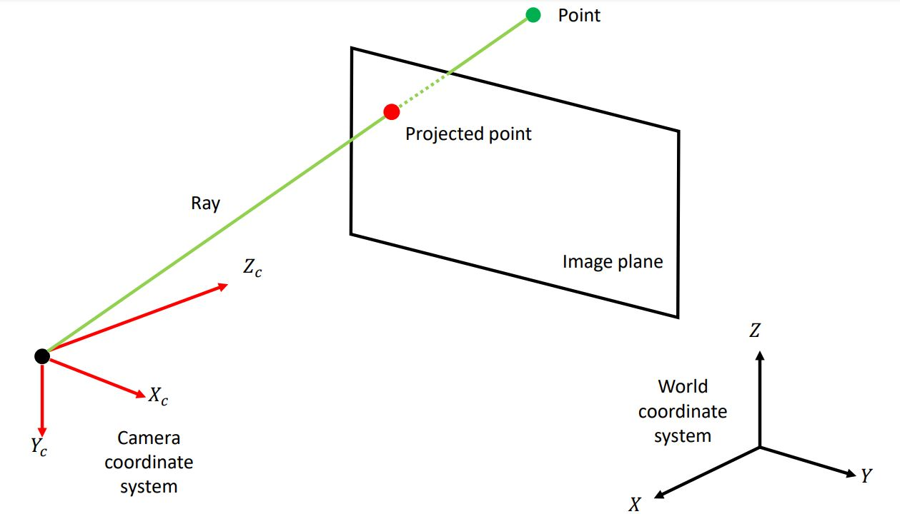

본 포스트는 학습을 위하여 작성한 것으로 내용상의 오류가 존재할 수 있습니다.

해당 내용들은 서울대학교 수리과학부 현동훈 교수님의 '대수학특강' 수업과 'Multiple View Geometry in Computer Vision' 책을 참고하였습니다.

#### (1-1) Camera coordinate and Homogenous representation

아래의 그림과 같이 카메라는 3차원 공간상의 한 점(point)을 2차원 이미지 평면(image plane)상의 점(projected point)으로 투사(projective)한다. 이 때 ray(초록색 직선)상의 모든 점들은 이미지 평면 상의 하나의 점으로 투사되므로 투영 공간(projective space)에서는 이 ray를 하나의 점으로 취급하며 이를 표현하기 위하여 homogeneous coordinate가 이용된다.

$P^2$(2차원 projective space)는 $$R^3$$의 projective space이며 $P^2$에서 한 점의 homogeneous coordinate는 $[x y w]^T$이다.
